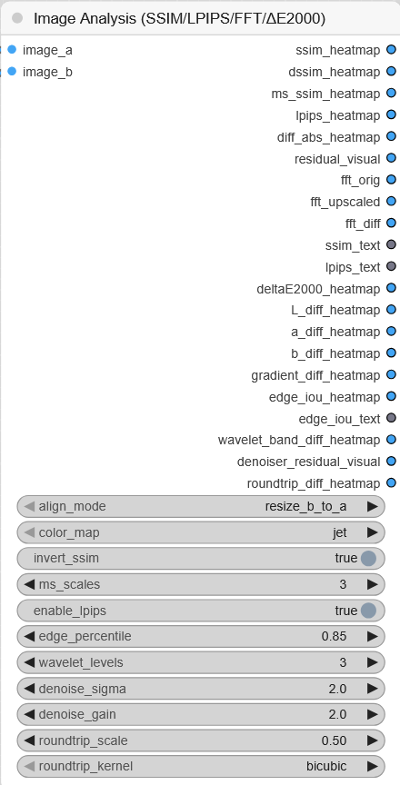

# ComfyUI Multi-Analysis Heatmaps

A custom ComfyUI node for **visual comparison of two images** using multiple perceptual and mathematical methods.  
The goal: make hidden differences *visible* as colorful heatmaps, so you can **see** where an upscaler, denoiser, or diffusion model changed your image — even when your eyes can’t tell at first glance.

---

## ✨ Features

Each method outputs its own heatmap (and sometimes a numeric score) so you can inspect everything side by side:

- **SSIM / DSSIM / MS-SSIM**  
  Structural similarity.  
  - Bright = dissimilar, dark = similar.  
  - DSSIM is the inverse (bright = more difference).  
  - MS-SSIM averages across multiple scales (robust to small shifts).

- **LPIPS (VGG16, perceptual map)**  
  Estimates whether differences are **visible to human perception**.  
  - Bright areas = regions that look different to the eye.  
  - Dark = visually similar.

- **Per-Pixel Difference (Abs)**  
  Direct pixel math.  
  - Bright = strong raw value difference, even if imperceptible.

- **Residual (Signed)**  
  Highlights what B has **added or removed** compared to A.  
  - Bright = added details/noise.  
  - Dark = lost details.

- **FFT / Spectrum Analysis**  
  Looks at **frequency content** (textures, fine detail).  
  - Shows original spectrum, upscaled spectrum, and difference.  
  - Large changes in high frequencies = sharpening or hallucinated texture.

- **ΔE2000 (Color Difference)**  
  Shows perceptual color shifts in Lab color space.  
  - Includes total ΔE2000 heatmap and individual **L\*** (lightness), **a\*** (red/green), **b\*** (blue/yellow) differences.

- **Gradient Difference (Scharr)**  
  Compares edge strength.  
  - Bright = edge got stronger/weaker.  
  - Useful to detect oversharpening.

- **Edge IoU (Canny-like)**  
  Compares binary edge maps of A and B.  
  - Bright = edges overlap.  
  - Gray = edges differ.  
  - Includes IoU score as text output.

- **Wavelet Band Difference**  
  Multi-scale Haar wavelet decomposition.  
  - Bright = changes in fine details/texture.

- **Denoiser Residual**  
  Highlights **high-frequency noise patterns**.  
  - Bright = new noise/texture in B.  
  - Can reveal “fake texture” added by diffusion upscalers.

- **Round-Trip Stability**  
  Downscale & re-upscale B, compare to itself.  
  - Bright = unstable areas (info lost or artifacts added).  
  - Useful to judge robustness, not just looks.

---

## 🧑‍🎨 How to Interpret

Think of each heatmap as a **different pair of glasses**:

- **Dark = good match** (few differences)  
- **Bright = more change** (differences, artifacts, or enhancements)  

Use the right “glasses” depending on what you care about:
- **Overall similarity:** SSIM / DSSIM  
- **Human perception:** LPIPS, MS-SSIM  
- **Color shifts:** ΔE2000, a\*, b\*  
- **Sharpness / edges:** Gradient Diff, Edge IoU  
- **Textures / hallucinations:** FFT Diff, Wavelet Diff, Denoiser Residual  
- **Robustness:** Round-Trip Stability  

---

## ⚠️ Disclaimer

This project is **vibe-coded**:  
- Heatmaps are **heuristic visualizations**.  
- Bright ≠ bad, dark ≠ good — interpretation depends on context.  
- The node does *not* decide quality for you.  

👉 **Interpretation and responsibility are fully on the user.**  
These tools are meant for exploration and intuition, not absolute ground-truth judgment.

---

## 📸 Example


---

## 🛠 Installation

1. Clone or download this repo into your `ComfyUI/custom_nodes/` folder:
   ```bash
   git clone https://github.com/Justify87/ComfyUI-Multi-Analysis-Heatmaps


## Additionals

- Upscaler Used in the example workflow:
- https://github.com/daredevilstudio/AI-upscaling-models
- https://github.com/daredevilstudio/AI-upscaling-models/releases/download/PureVision/2x_PureVision.pth
- image compare node:
- https://github.com/quasiblob/ComfyUI-EsesImageCompare


## ⚙️ Node Options




The **Multi-Analysis Heatmap Node** provides several options to control how comparisons are made:

| Option | Type | Default | Description |
|--------|------|---------|-------------|
| **align_mode** | combo | `resize_b_to_a` | How to align the two input images: <br>• `resize_b_to_a` → resizes B to match A <br>• `center_crop_to_min` → crops both to the smaller overlap <br>• `pad_to_max` → pads smaller one with black pixels |
| **color_map** | combo | `jet` | The color scheme for heatmaps: <br>• `jet` → rainbow style (bright = more difference) <br>• `grayscale` → black–white map |
| **invert_ssim** | bool | `true` | Flip SSIM visualization so differences appear **bright** instead of dark. |
| **ms_scales** | int | `3` | Number of scales for **MS-SSIM**. Higher = more robust but slower. |
| **resid_gain** | float | `2.0` | Strength multiplier for the **Residual Visualization**. Higher = amplifies added/removed details more strongly. |
| **fft_log_eps** | float | `1e-3` | Stabilization constant for FFT log spectrum. Adjust only if you see black/overblown spectra. |
| **enable_lpips** | bool | `false` | Whether to compute the **LPIPS perceptual heatmap** (uses VGG16 features, slower, more VRAM). |
| **denoise_sigma** | float | `1.0` | Standard deviation for Gaussian blur in **Denoiser Residual**. Controls how aggressively “noise” is extracted. |
| **denoise_gain** | float | `2.0` | Amplification factor for the residual visualization in **Denoiser Residual**. |
| **roundtrip_scale** | float | `0.5` | Downscale factor for **Round-Trip Stability** test. (0.5 = downscale by 2×, then upscale again). |
| **roundtrip_kernel** | combo | `bicubic` | Resampling kernel for round-trip test. Options: `bicubic`, `bilinear`, `lanczos`. |

---

👉 **Tip:**  
- Start with defaults.  
- Enable `LPIPS` only if you want human-perception-like feedback.  
- Use `invert_ssim = true` for easier visual spotting (bright = problem).  
- Play with `resid_gain` and `denoise_gain` if maps look too weak/too strong.


